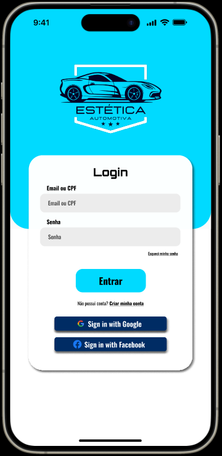
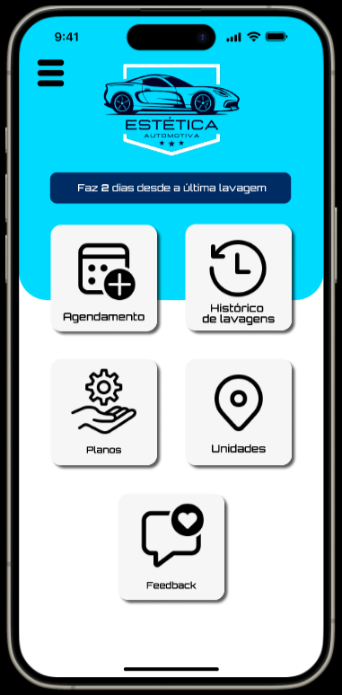
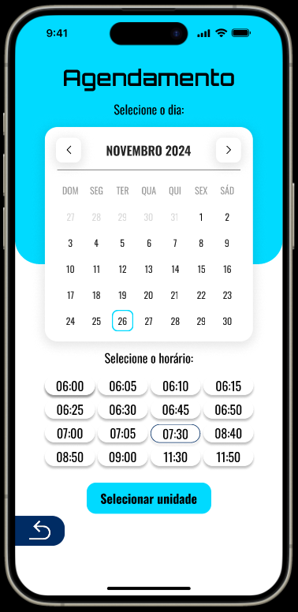

# 🚗 App de Agendamento de Lavagem de Veículos

Projeto acadêmico desenvolvido em grupo para a disciplina de **UX/UI**.  
Este é o protótipo de um **aplicativo mobile** que permite ao usuário agendar a lavagem do seu veículo no ponto de lavagem cadastrado mais próximo.

## ✅ Objetivo do Projeto

O objetivo principal do aplicativo é **oferecer comodidade e agilidade** para motoristas que desejam agendar a lavagem de seus veículos sem precisar esperar em filas ou perder tempo. O app busca facilitar o dia a dia de pessoas com rotinas corridas, como motoristas de aplicativo, frotistas ou qualquer pessoa que valorize a praticidade.

## 🧩 Problema Que o Projeto Resolve

Muitos motoristas enfrentam dificuldades com:

- Longas filas em lava-rápidos
- Falta de tempo para cuidar da limpeza do carro
- Dificuldade em encontrar locais de confiança

**Solução proposta**: um aplicativo que concentra unidades de lavagem de veículos e permite agendamento prévio, visualização de serviços disponíveis, horários e planos personalizados.

## 🎨 Protótipo no Figma

🔗 [Clique aqui para acessar o protótipo](https://www.figma.com/proto/4sAz3TVxPvOde5MPHqCWy8/ADO-2---UX-UI?node-id=130-247&starting-point-node-id=130%3A247&t=0tQ0wEpAGje9hue6-1)

## 🧠 Tecnologias e Ferramentas Utilizadas

- Figma – Design e prototipagem de interfaces
- Princípios de UX (User Experience) – Para criar uma jornada fluida e intuitiva para o usuário
- Princípios de UI (User Interface) – Para um visual moderno, limpo e coerente
- Design Mobile First – Layout otimizado para dispositivos móveis

## 👥 Integrantes

- Giovanna Barbosa de Souza  
- Giovana Najara de Almeida Santos
- Stephany Sousa Santos

## 🖼️ Identidade Visual

### Logo Marca

### Telas do Aplicativo

#### Tela Login
Apresenta o nome do aplicativo com design atrativo e opção de entrar ou criar conta. Acesso rápido à conta.

#### 🔹 Tela Principal
Exibe a logomarca do app, uma barra com o tempo desde a última lavagem e botões com as principais funcionalidades, como agendamento, histórico, planos, unidades e feedback.

#### 🔹 Tela de Agendamento
Tela onde o usuário pode selecionar data, horário e unidade de lavagem, conforme disponibilidade.

