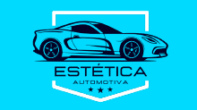

# 🚗 App de Agendamento de Lavagem de Veículos

Projeto acadêmico desenvolvido em grupo para a disciplina de **UX/UI**.  
Este é o protótipo de um **aplicativo mobile** que permite ao usuário agendar a lavagem do seu veículo no ponto de lavagem cadastrado mais próximo.

## 🎨 Protótipo no Figma

🔗 [Clique aqui para acessar o protótipo](https://www.figma.com/proto/4sAz3TVxPvOde5MPHqCWy8/ADO-2---UX-UI?node-id=130-247&starting-point-node-id=130%3A247&t=0tQ0wEpAGje9hue6-1)

## 🧠 Tecnologias e Ferramentas Utilizadas

- Figma (protótipo de interface)
- Princípios de UX/UI
- Design Mobile First

## 👥 Integrantes

- Giovanna Barbosa de Souza  
- Giovana Najara de Almeida Santos
- Stephany Sousa Santos

## 🖼️ Logo Marca

## 🖼️ Telas do App

### Tela Inicial

### Tela Login

### Tela Agendamento

